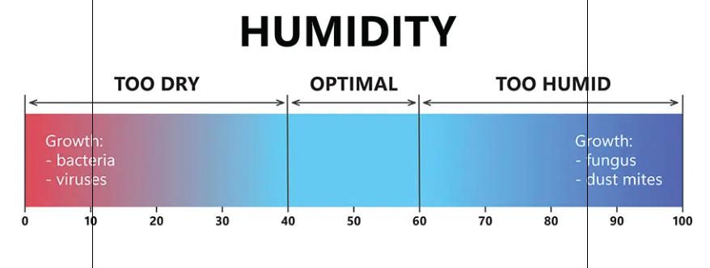

# Air Quality Report (Draft Version)

get_most_recent_log GET `https://airquality.zeqa.net/air_quality/get_most_recent_log/`
```
[
    {
        "temperature": 20,
        "humidity": 33,
        "CO": 813,
        "temperature_status": "Cool",
        "humidity_status": "Too Dry",
        "CO_status": "Good"
    }
]
```

get_last_ten_minutes_logs GET `https://airquality.zeqa.net/air_quality/get_last_ten_minutes_logs/`
```
[
    {
        "time": 10,
        "temperature": 27,
        "humidity": 63,
        "CO": 1239,
        "temperature_status": "Normal",
        "humidity_status": "Too Humid",
        "CO_status": "Normal"
    },
    {
        "time": 9,
        "temperature": 23,
        "humidity": 72,
        "CO": 1321,
        "temperature_status": "Normal",
        "humidity_status": "Too Humid",
        "CO_status": "Normal"
    },
    {
        "time": 8,
        "temperature": 26,
        "humidity": 30,
        "CO": 1293,
        "temperature_status": "Normal",
        "humidity_status": "Too Dry",
        "CO_status": "Normal"
    },
    {
        "time": 7,
        "temperature": 25,
        "humidity": 54,
        "CO": 1336,
        "temperature_status": "Normal",
        "humidity_status": "Optimal",
        "CO_status": "Normal"
    },
    {
        "time": 6,
        "temperature": 22,
        "humidity": 55,
        "CO": 1421,
        "temperature_status": "Cool",
        "humidity_status": "Optimal",
        "CO_status": "Normal"
    },
    {
        "time": 5,
        "temperature": 22,
        "humidity": 39,
        "CO": 1406,
        "temperature_status": null,
        "humidity_status": "Too Dry",
        "CO_status": "Normal"
    },
    {
        "time": 4,
        "temperature": 24,
        "humidity": 49,
        "CO": 1307,
        "temperature_status": "Normal",
        "humidity_status": "Optimal",
        "CO_status": "Normal"
    },
    {
        "time": 3,
        "temperature": 21,
        "humidity": 59,
        "CO": 1319,
        "temperature_status": "Cool",
        "humidity_status": "Optimal",
        "CO_status": "Normal"
    },
    {
        "time": 2,
        "temperature": 24,
        "humidity": 61,
        "CO": 1183,
        "temperature_status": "Normal",
        "humidity_status": "Too Humid",
        "CO_status": "Normal"
    },
    {
        "time": 1,
        "temperature": 22,
        "humidity": 50,
        "CO": 1443,
        "temperature_status": "Cool",
        "humidity_status": "Optimal",
        "CO_status": "Normal"
    }
]

```

update_data and led_color POST `https://airquality.zeqa.net/air_quality/update_data/`

body
```
{
    "temperature" : 26,
    "humidity" : 70,
    "co" : 100
}
```

response
```
{
    "temperature_R": 0,
    "temperature_G": 255,
    "temperature_B": 0,
    "humidity_R": 86,
    "humidity_G": 105,
    "humidity_B": 177,
    "CO_R": 0,
    "CO_G": 255,
    "CO_B": 0
}
```

turn on sensor led POST `https://airquality.zeqa.net/turn_on/{sensor_type}`

example response

```
{
    "temperature": true
}
```

turn off sensor led POST `https://airquality.zeqa.net/turn_off/{sensor_type}`

example response

```
{
    "temperature": false
}
```

## color range reference

temperature (from cold to very hot)


humidity



CO (from good to worst)


